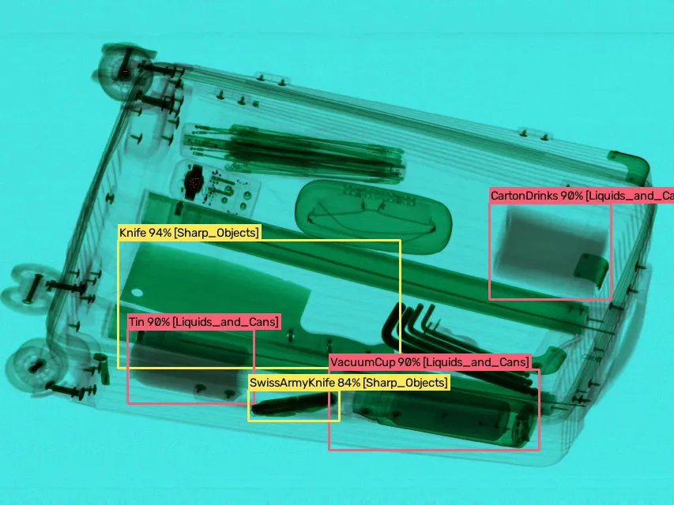
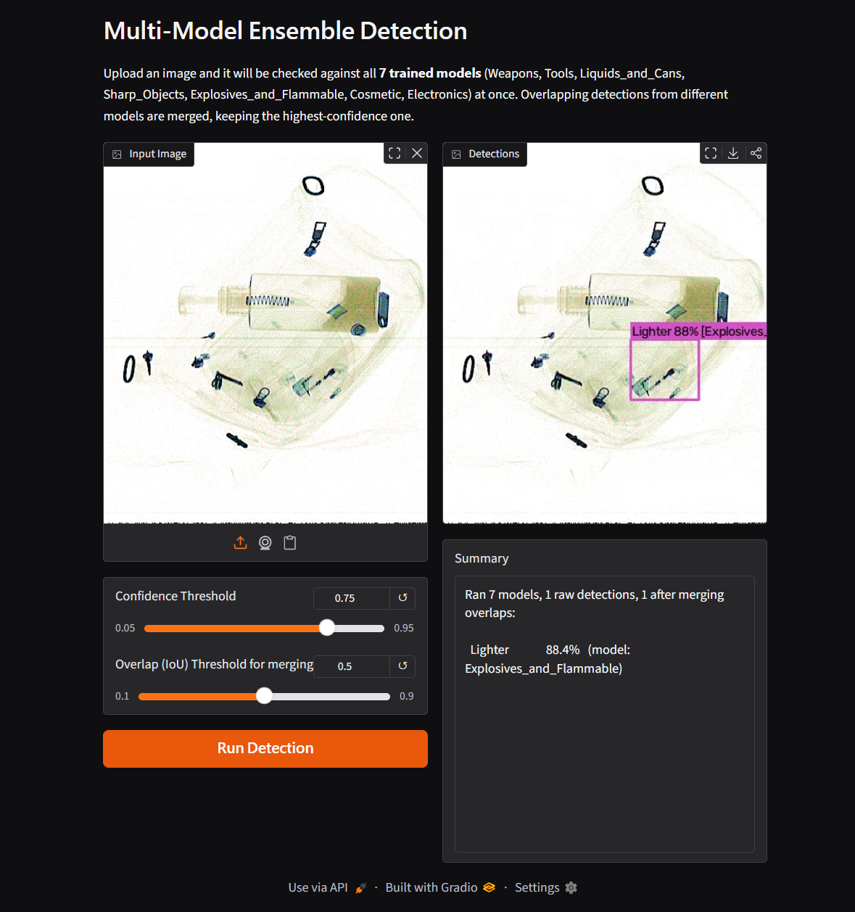

# X-ray Customs Security Detection — Multi-Model YOLO Ensemble

An end-to-end computer vision system that detects prohibited and suspicious items in **X-ray baggage scans**, built for customs and airport security screening. The project merges **9 public X-ray datasets** into one unified taxonomy, trains **7 specialized YOLOv8 models**, and serves them through a single web interface that runs all models on every image and merges their results in real time.

<p align="center">
  
</p>

---

## Overview

Security X-ray screening is a classic multi-class object detection problem, but with a twist: the objects of interest range from knives and firearms to lighters, power banks, and liquids — categories that look nothing alike and don't share visual features. Instead of forcing one model to learn all 38 classes at once, this project takes a **divide-and-specialize** approach:

- **7 independent YOLOv8 models**, one per object category, each trained only on its own group of visually related classes.
- A **Gradio ensemble interface** that runs every uploaded scan through all 7 models simultaneously, then merges overlapping detections using IoU-based filtering — keeping only the highest-confidence box per object.
- A **fully reproducible data pipeline** that standardizes, cleans, merges, and splits 9 heterogeneous public X-ray datasets into one consistent, trainable format.

The result is a system where any single category can be retrained or improved independently, without retouching the other six models.

---

## Why 7 Models Instead of 1?

| Criterion | Single Model (38 classes) | 7 Models + Ensemble (this project) |
|---|---|---|
| Per-category accuracy | Lower — confuses visually unrelated classes | Higher — each model specializes in one coherent category |
| Inference time per image | Faster (one pass) | Slower (7 passes + merge step) |
| Retraining a single category | Requires retraining everything | Only the affected model needs retraining |

---

## Data Pipeline

The training data comes from **9 public X-ray datasets** (HiXray, GDXray-Baggages, ClCXray, DvXray, HUMSXray, X-ray Contraband, OPIXray, SiXray, and LDXray), each originally published in a different annotation format — custom CSV, COCO JSON, Pascal VOC XML, and pre-formatted YOLO. LDXray was fully converted but excluded from the final training set due to bounding boxes that didn't match object scale.

The raw sources were processed through a 6-stage pipeline:

1. **Dataset Collection** — sourcing and validating 9 public X-ray datasets.
2. **Format Standardization** — a dedicated converter per source, normalizing every annotation format into the standard YOLO `class x_center y_center width height` format.
3. **Data Cleaning** — automated match-checking between images and labels, with a strict *report → confirm → delete* workflow to safely remove orphan files.
4. **Merging & Taxonomy** — a unified taxonomy dictionary mapping every source-specific class alias (e.g. `knife`, `Knife`, `KnifeCustom`) to one final class ID, so adding a new dataset later only requires adding its aliases.
5. **Stratified Train/Val/Test Split (70/15/15)** — a custom greedy, per-class-balanced splitting algorithm that processes rarest classes first, ensuring even rare categories are represented in every split.
6. **Ready-for-Training Packaging** — each category shipped as a self-contained package (images, labels, `classes.txt`, `dataset.yaml`, `train.py`).

---

## Classes & Taxonomy

**7 main categories · 38 total classes**, aggregated from overlapping labels across all 9 source datasets.

| Category | # Classes | Classes |
|---|---|---|
| **Weapons** | 5 | Bat, Baton, Bullet, Gun, HandCuffs |
| **Tools** | 4 | Hammer, Plier, Screwdriver, Wrench |
| **Liquids & Cans** | 7 | Cans, CartonDrinks, GlassBottle, PlasticBottle, Tin, VacuumCup, Water |
| **Sharp Objects** | 12 | Blade, Dagger, Dart, Folding Knife, Knife, Multi-tool Knife, Razor Blade, Saw Blade, Scissors, Straight Knife, SwissArmyKnife, Utility Knife |
| **Explosives & Flammable** | 7 | Battery, Fireworks, Lighter, Nonmetallic Lighter, Pressure Vessel, SprayCans, Sprayer |
| **Cosmetic** | 1 | Cosmetic |
| **Electronics** | 4 | Laptops, Mobile phones, PowerBank, Tablet |

> The full numbered class list for every model is available in [`all_classes.txt`](all_classes.txt).

---

## Model Training

Each of the 7 models is trained independently with **transfer learning**, starting from COCO-pretrained **YOLOv8m** weights — chosen as a balance between speed and accuracy for a moderate number of classes per category. Key training choices:

- **30 epochs** with **early stopping** (patience = 15) to prevent overfitting.
- **Cosine learning rate schedule** for smooth decay.
- **Mosaic (1.0) and Mixup (0.1) augmentation** to improve detection of small and partially occluded objects — common in cluttered baggage scans.
- Checkpoints saved every 5 epochs, not just best/last.

The same training script is reused for all 7 categories by simply pointing it to a different dataset config and output path — no code duplication.

---

## Multi-Model Ensemble Detection Interface

A single X-ray scan can contain items from several categories at once (e.g. a weapon *and* a liquid in the same bag). Rather than picking one model, the app runs **all 7 models on every uploaded image simultaneously**, then merges the results:

1. All 7 `.pt` model files are loaded once at startup (not per-request) for fast inference.
2. Every detection's box is compared against every other using **IoU (Intersection over Union)**.
3. Detections are sorted by confidence; any box that overlaps an already-accepted higher-confidence box beyond the IoU threshold is discarded — keeping only the best detection per real-world object.
4. Results are rendered on a **Gradio web interface** with adjustable confidence and IoU-merge sliders, running locally at `http://127.0.0.1:7860`.

<p align="center">
  
</p>

Each model is assigned a fixed, consistent color for its bounding boxes, so the source model of any detection is visible at a glance directly on the output image.

---

## Deployment & Automation

The project is designed to run with a single click on any Windows machine, no manual setup required:

- **First-time setup** — automatically creates an isolated virtual environment, installs all pinned dependencies, opens the browser, and launches the app.
- **Quick launch** — for repeated use after the initial setup, skipping the environment checks and starting the app immediately.

Dependencies are fully pinned in `requirements.txt`, including a CUDA-enabled build of PyTorch for GPU acceleration (with a documented CPU-only fallback for machines without a compatible NVIDIA GPU).

---

## YOLO Version Selection Guide

| Deployment Scenario | Recommended Version | Why |
|---|---|---|
| Low-power edge devices (e.g. Raspberry Pi) | YOLO26 (Nano) | Best on CPU, NMS-free and DFL-free |
| Crowded bags with overlapping/occluded items | YOLOv9 | Retains detail via PGI, even for partially concealed objects |
| High-accuracy server-side system | YOLO11 | Best accuracy-to-parameter efficiency balance |
| Lowest possible latency (fast triage systems) | YOLOv10 or YOLO26 | Fully NMS-free |

---

## Tech Stack

- **Detection:** Ultralytics YOLOv8
- **Interface:** Gradio
- **Image processing:** OpenCV
- **Training backend:** PyTorch (CUDA 12.4)
- **Data tooling:** pandas, scikit-learn, iterative-stratification

---

## Repository Structure

```
├── Original_Data/                    # Raw data as received from the 9 sources (untouched backup)
├── Data_Preprocessing_Scripts/       # Format conversion, cleaning, and merging scripts
├── Data_Based_On_Original_Source/    # Processed data, still split by original source
├── Ready_For_Training_Data/          # Final merged + stratified split, ready to train
├── All_Result_For_Training/          # Training outputs: weights, plots, logs (per category)
├── Detection_App/                    # Deployment app: web interface + automation scripts
└── assets/                           # README images
```

---

## Project Status

Complete — from raw multi-source data collection through model training to a one-click deployable detection interface.

---

## Roadmap

- Re-evaluate and reintroduce the LDXray dataset with corrected bounding boxes.
- Expand the ensemble to newer NMS-free YOLO versions (YOLO26 / YOLOv10) for lower-latency deployment.
- Package the app for cross-platform (non-Windows) automated setup.
